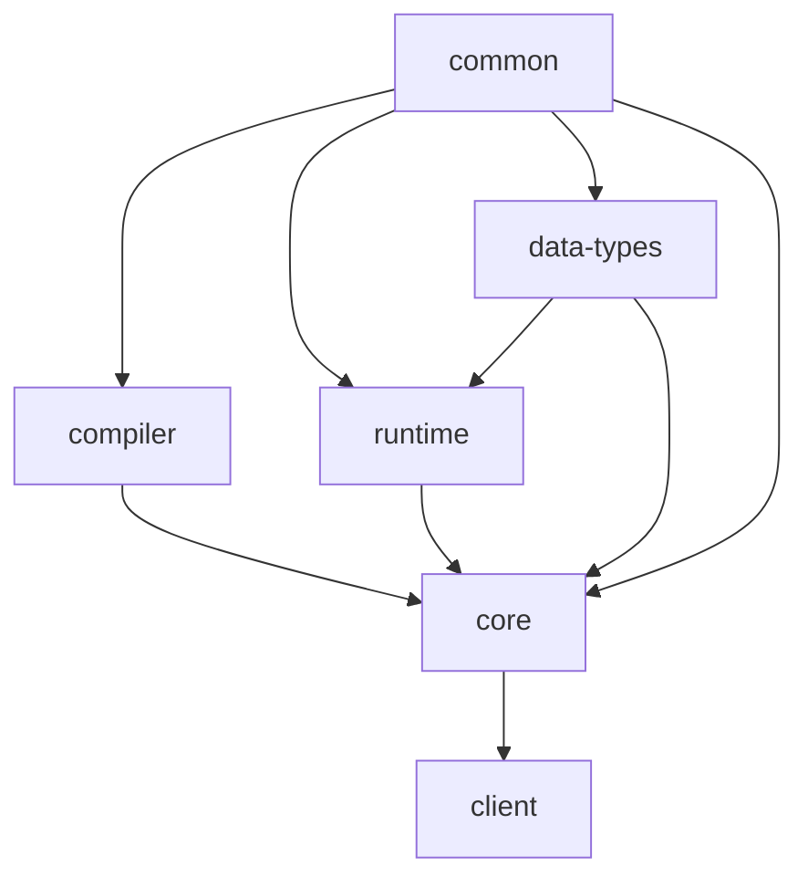

# NebulaStream 

NebulaStream is our attempt to develop a general purpose, end-to-end data management system for the IoT.
It provides an out-of-the box experience with rich data processing functionalities and a high ease-of-use.

NebulaStream is a joint research project between the DIMA group at TU Berlin and the DFKI IAM group.

Learn more about Nebula Stream at https://www.nebula.stream

Visit our documentation at https://docs.nebula.stream

## Documentation
- API:
    - [Query API](https://docs.nebula.stream/docs/query-api/generalconcept/) 
    - [REST API](https://docs.nebula.stream/docs/clients/rest-api/)     
    - [JAVA Client](https://docs.nebula.stream/docs/clients/java-client/)
- Development:
    - [Contribution-guidelines](https://docs.nebula.stream/docs/dev/contribution-guidelines/)
  
## Components:

The codebase is structured in the following components:

| Component                        | Description                                                                                                                 |
|----------------------------------|-----------------------------------------------------------------------------------------------------------------------------|
| [nes-common](nes-common)         | This component contains some base functionality that is used across all other components, e.g., for logging and exceptions. |
| [nes-data-types](nes-data-types) | This component contains the basic data types of the system.                                                                 |
| [nes-compiler](nes-compiler)     | This component contains functionalities to compile source code or intermediate representations to executable binaries.      |
| [nes-runtime](nes-runtime)       | This component contains all runtime components for the network stack and the memory managment                               |
| [nes-core](nes-core)             | This component contains the main aspects of the overall system.                                                             |
| [nes-client](nes-client)         | This component contains the C++ client to interact with NebulaStream from C++ applications.                                 |

### Dependencies:

